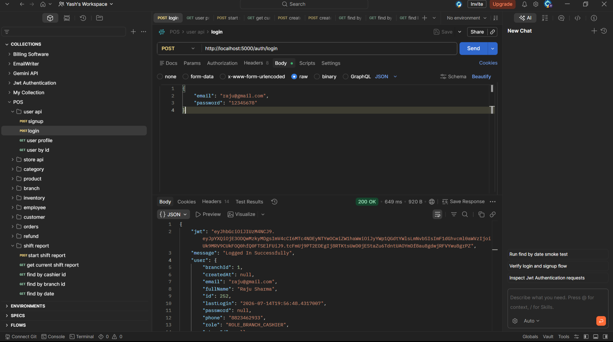
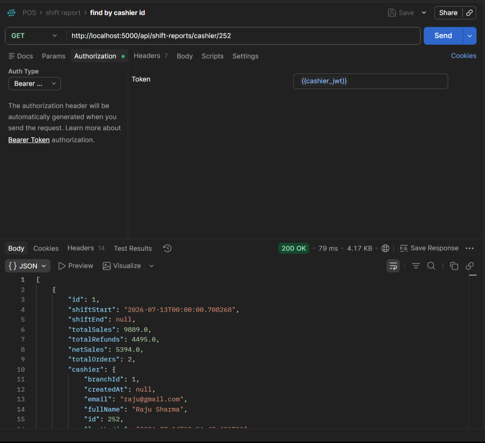
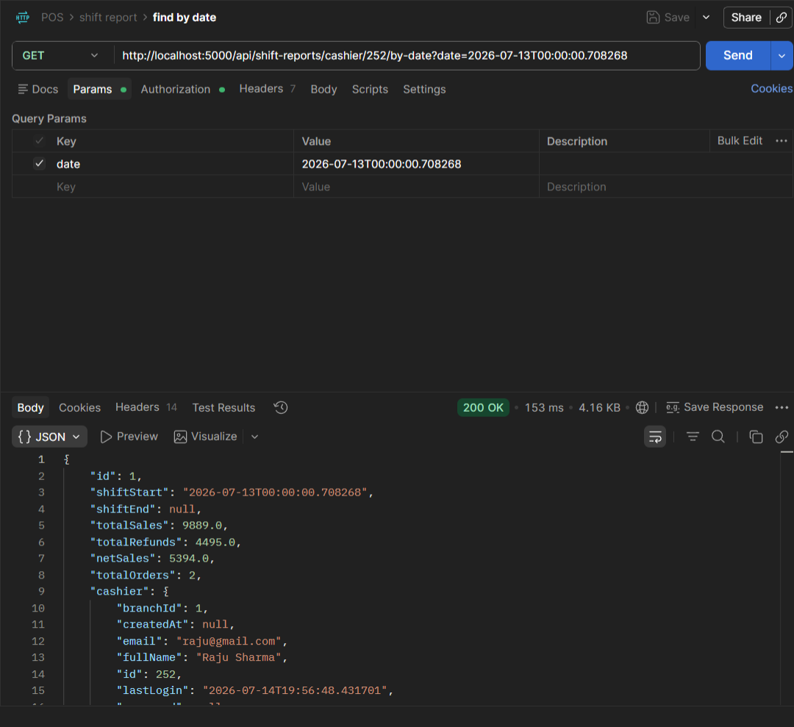
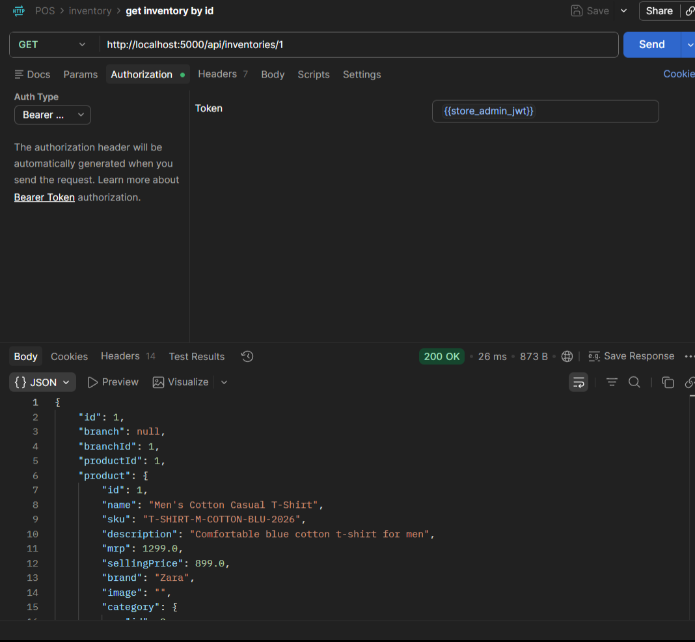
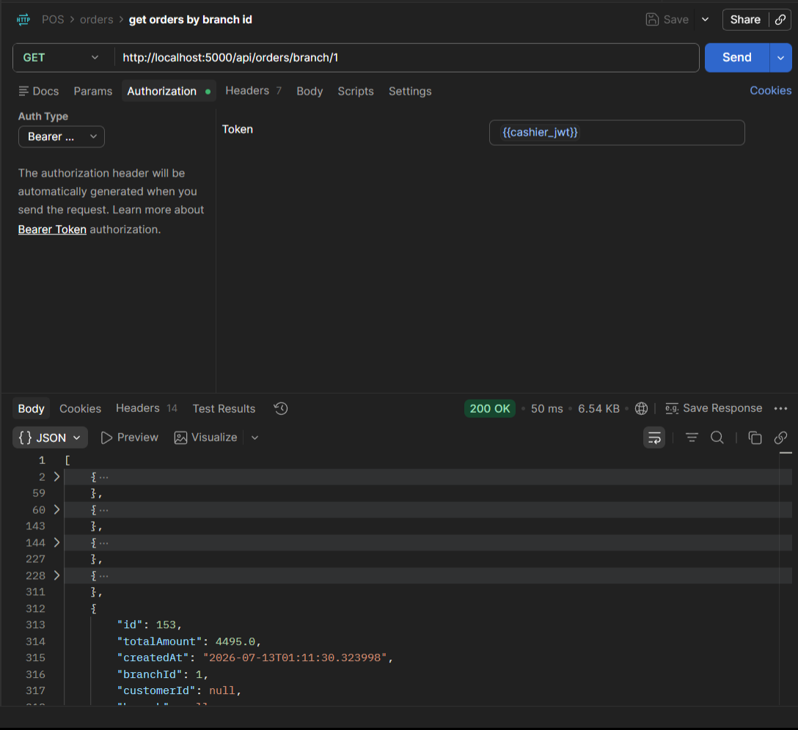

# POS System (Backend)

A robust and scalable **Point of Sale (POS) System Backend** built using **Spring Boot**. This project provides RESTful APIs for managing products, categories, customers, orders, inventory, and billing operations required for a modern POS application.

> **Note:** This repository contains **only the backend** of the POS System.

---

## 📌 Project Overview

The POS System Backend is designed to automate retail store operations by providing APIs for:

- Store Management
- Branch Management
- Product Management
- Category Management
- Customer Management
- Employee Management
- User Management
- Refund Management
- Order Processing
- Inventory Management
- Billing
- Shift Reports
- Sales Tracking
- User Authentication 

The backend follows a layered architecture using Spring Boot best practices to ensure maintainability, scalability, and clean code.

---

## 🎯 Features

### Authentication
- User Registration (Sign Up)
- User Login
- JWT-based Authentication
- Secure Password Encryption (BCrypt)
- Protected REST APIs using Spring Security

### Store Management
- Create and manage stores
- Update store information
- View store details

### Branch Management
- Create new branches
- Update branch details
- View branch information
- Manage multiple branches under a store

### Product Management
- Add new products
- Update product information
- Delete products
- View all products
- Search products

### Category Management
- Create categories
- Update categories
- Delete categories
- View categories

### Customer Management
- Register customers
- Update customer details
- Retrieve customer information

### Order Management
- Create customer orders
- Add multiple products to an order
- Calculate total amount
- Store order history

### Inventory Management
- Track product stock
- Update inventory after sales
- Prevent invalid stock operations

### Employee Management
- Add employees
- Update employee information
- View employee details
- Manage employee records

### User Management
- Access user data using id and current profile

### Refund Management
- Process product refunds
- Record refund transactions
- Update inventory after refunds
- Maintain refund history

### Billing
- Generate order totals
- Calculate item-wise pricing
- Store transaction details

### Shift Reports
- Generate daily shift reports
- Track sales during a shift
- View shift summaries
- Monitor cashier performance
- Monitor branch performance 

### REST API
- RESTful endpoints
- JSON request/response format
- Standard HTTP status codes

---

## 🛠️ Tech Stack

| Technology | Purpose |
|------------|---------|
| Java 21 | Programming Language |
| Spring Boot | Backend Framework |
| Spring MVC | REST API Development |
| Spring Security | Authentication & Authorization |
| JWT (JSON Web Token) | Secure Token-Based Authentication |
| Spring Data JPA | Database Operations |
| Hibernate | ORM (Object Relational Mapping) |
| MySQL | Relational Database |
| Maven | Dependency Management & Build Tool |
| Lombok | Boilerplate Code Reduction |
| Jackson | JSON Serialization & Deserialization |

---

## 📁 Project Structure

```
POS-System
│
├── src
│   ├── main
│   │   ├── java
│   │   │   └── com
│   │   │       └── ...
│   │   │           ├── configuration
│   │   │           ├── controller
│   │   │           ├── domain
│   │   │           ├── exceptions
│   │   │           ├── mapper
│   │   │           ├── model (entity)
│   │   │           ├── payload
│   │   │               └── dto
│   │   │               └── response
│   │   │           ├── repository
│   │   │           ├── service
│   │   │
│   │   └── resources
│   │       ├── application.properties
│   │       └── ...
│   │
│   └── test
│
├── pom.xml
└── README.md
```

> The exact package structure may vary depending on the current implementation.

---

## 🏗️ Architecture

The project follows a **Layered Architecture**.

```
Client
   │
   ▼
Controller Layer
   │
   ▼
Service Layer
   │
   ▼
Repository Layer
   │
   ▼
MySQL Database
```

### Layers

- **Controller**
  - Handles HTTP requests.
  - Returns API responses.

- **Service**
  - Contains business logic.

- **Repository**
  - Handles database operations using Spring Data JPA.

- **Entity**
  - Represents database tables.

- **DTO**
  - Transfers data between client and server.

---

## ⚙️ Installation

### Clone the Repository

```bash
git clone https://github.com/YashKhawale/POS-System.git
```

Navigate to the project directory.

```bash
cd POS-System
```

---

## 📦 Configure Database

Create a MySQL database.

```sql
CREATE DATABASE pos_system;
```

Update your `application.properties`.

```properties
spring.datasource.url=jdbc:mysql://localhost:3306/pos_system
spring.datasource.username=your_username
spring.datasource.password=your_password

spring.jpa.hibernate.ddl-auto=update
spring.jpa.show-sql=true
```

---

## ▶️ Run the Project

Using Maven

```bash
mvn spring-boot:run
```

Or

Run the main Spring Boot application class directly from your IDE.

The backend will start on:

```
http://localhost:8080
```

---

## 📡 API Endpoints

The exact endpoints depend on your implementation.

Example APIs include:

### Authentication

| Method | Endpoint | Description |
|---------|----------|-------------|
| POST | `/auth/signup` | Staff signup |
| POST | `/auth/login` | Staff login |

---

### Branch

| Method | Endpoint | Description |
|---------|----------|-------------|
| GET | `/api/branches/store/{storeId}` | Get all branches by store id |
| GET | `/api/branches/{id}` | Get branch by ID |
| POST | `/api/branches` | Add branch |
| PUT | `/api/branches/{id}` | Update branch |
| DELETE | `/api/branches/{id}` | Delete branch |

---

### Product

| Method | Endpoint | Description |
|---------|----------|-------------|
| GET | `/products` | Get all products |
| GET | `/products/{id}` | Get product by ID |
| POST | `/products` | Add product |
| PUT | `/products/{id}` | Update product |
| DELETE | `/products/{id}` | Delete product |

---

### Categories

| Method | Endpoint | Description |
|---------|----------|-------------|
| GET | `/api/categories/{id}` | Get category |
| GET | `/api/categories/store/{storeId}` | Get all categories by store id |
| POST | `/api/categories` | Add category |
| PUT | `/api/categories/{id}` | Update category |
| DELETE | `/api/categories/{id}` | Delete category |

---

### Customers

| Method | Endpoint | Description |
|---------|----------|-------------|
| GET | `/api/customers` | Get all customers |
| GET | `/api/customers/{id}` | Get customer by id |
| GET | `/api/customers/search` | Search customer by keyword |
| POST | `/api/customers` | Add customer |
| PUT | `/api/customers/{id}` | Update customer |
| DELETE | `/api/customers/{id}` | Delete customer |

---

### Orders

| Method | Endpoint | Description |
|---------|----------|-------------|
| GET | `/api/orders/{id}` | Get order by id |
| GET | `/api/orders/branch/{branchId}` | Get all orders by branch id |
| GET | `/api/orders/cashier/{cashierId}` | Get all orders by cashier id |
| GET | `/api/orders/today/branch/{branchId}` | Get today orders by branch id |
| GET | `/api/orders/customer/{customerId}` | Get all orders by customer id |
| GET | `/api/orders/recent/{branchId}` | Get top 5 recent orders by branch id |
| POST | `/api/orders` | Add order |
| DELETE | `/api/orders/{id}` | Delete order |

---

## 🧪 Testing

The APIs can be tested using:

- Postman
- Insomnia
- Thunder Client

### 🔑 Authentication (Login)


### 📊 Shift Reports & Sales Tracking
| Find by Cashier ID | Find by Date |
|:---:|:---:|
|  |  |

### 📦 Inventory & Orders
| Get Inventory by ID | Get Orders by Branch ID |
|:---:|:---:|
|  |  |

Example POST request

```json
{
  "name": "Coffee",
  "price": 120,
  "quantity": 10
}
```

---

## 📚 Learning Objectives

This project helped in understanding:

- Spring Boot Development
- REST API Design
- CRUD Operations
- Layered Architecture
- Spring Data JPA
- Hibernate ORM
- DTO Pattern
- Exception Handling
- MySQL Integration
- Maven Project Structure
- JWT Authentication
- Role-Based Authorization (Admin/Cashier)
- Backend Development Best Practices

---

## 🚀 Future Improvements

- Frontend Integration
- Barcode Scanner Support
- Invoice PDF Generation
- Payment Gateway Integration
- Sales Reports & Analytics
- Unit & Integration Testing
- Docker Support
- Swagger/OpenAPI Documentation
- Redis Caching
- Email Notifications

---


## 👨‍💻 Author

**Yash Khawale**

GitHub: https://github.com/YashKhawale

Repository: https://github.com/YashKhawale/POS-System

---

## ⭐ Support

If you found this project useful, consider giving it a **Star ⭐** on GitHub. It helps others discover the project and motivates future improvements.
